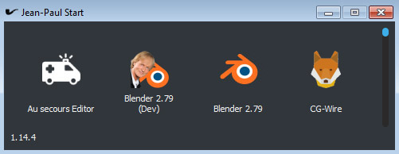

# jeanpaulstartui

PySide client for Jean-Paul Start



### Launching

Run the module `jeanpaulstartui` giving a path where to find batches, and the user tags description file

Batch pathes can be separated with ';'

````bash
python -m jeanpaulstartui --batches /path/to/a/batch/folder;/path/to/another/folder --tags /path/to/user-tags.yml
````
