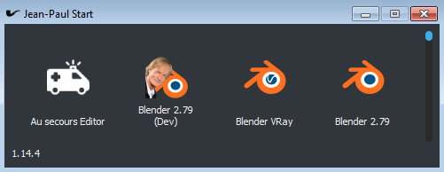

# jeanpaulstartui

PySide client for Jean-Paul Start



### Installation 

jeanpaulstartui uses Mottosso's [Qt5](https://github.com/mottosso/Qt5.py) to adapt itself to all Qt5 bindings.
If don't have any Qt5 binding installed in your environment, you must specify the binding you want to use:
```
# To install with PySide2 binding
pip install git+https://github.com/cube-creative/jeanpaulstartui.git[PySide2]

# To install with PyQt5 binding
pip install git+https://github.com/cube-creative/jeanpaulstartui.git[PyQt5]

# To install without PySide2 or PyQt5 (If a Qt5 binding is already provided by the environment you are installing to ex: maya)
pip install git+https://github.com/cube-creative/jeanpaulstartui.git
```

### Launching

Run the module `jeanpaulstartui` giving a path where to find batches, and the user tags description file

Batch pathes can be separated with ';'

````bash
python -m jeanpaulstartui --batches /path/to/a/batch/folder;/path/to/another/folder --tags /path/to/user-tags.yml
````
